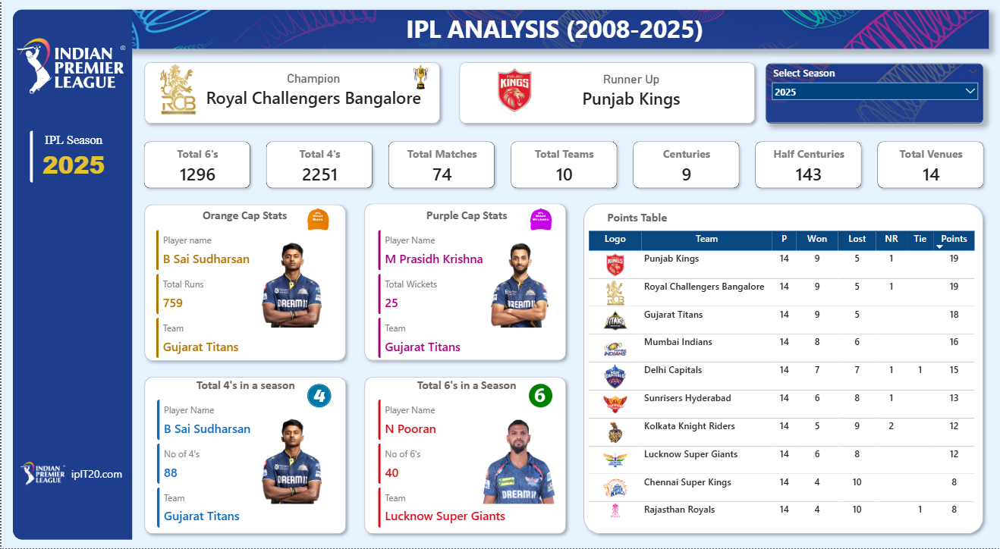

# IPL-Data-Analysis

IPL Data Analysis using Python &amp; Power BI with DAX
📌 Project Overview

This project presents an IPL Analytics Dashboard built using Power BI and Python, designed to analyze Indian Premier League (IPL) match data and uncover insights related to team performance, player statistics, match outcomes, and tournament trends.

The objective is to transform raw IPL datasets into interactive dashboards and meaningful insights to support data-driven analysis.

🚀 Key Features:

🔹 Team Performance Analysis
    * Total matches played and won
    
    * Team-wise win percentage
    
    * Season-wise performance comparison

🔹 Player Performance Analysis
    Top run scorers
    Top wicket takers
    Consistent players across seasons

🔹 Match & Toss Insights
    Toss decision vs match result analysis
    Impact of batting first vs chasing
    Match outcome trends

🔹 Venue & Season Analysis
    Venue-wise match distribution
    Home vs away performance
    Season-wise IPL trends

🛠 Tools & Technologies Used
  * Power BI – Interactive dashboards & data modeling
  * Power Query – Data cleaning & transformation
  * DAX – KPI and performance calculations
  * Python – Exploratory Data Analysis (EDA)
  * Pandas, NumPy – Data manipulation
  * Matplotlib, Seaborn – Visualizations
  * Excel / CSV – Data sources

🔄 Data Transformation (Power Query)
  * Data preprocessing was performed using Power Query Editor, including:
  * Removing duplicate records
  * Standardizing column names
  * Handling missing or null values
  * Converting data types
  * Merging matches and deliveries datasets
  * Creating a clean data model for reporting

🧮 DAX Measures Used
  * Total Matches
  * Total Wins
  * Win Percentage
  * Total Runs
  * Total Wickets
  * Average Score per Match
  * Toss Win Impact %

📊 Key Insights
  Teams winning the toss and choosing to field first have a higher win percentage
  Certain venues strongly favor chasing teams
  Consistent players significantly influence season outcomes
  Home ground advantage plays a major role in team success
  Win patterns vary clearly across seasons and venues

📂 Dataset
Due to GitHub file size limitations, large IPL datasets are hosted externally.
Full Dataset (CSV): <https://drive.google.com/file/d/1qsYh0m2lslkLSzVY3o9_35OH3O3fS4jd/view?usp=sharing>

🔮 Future Enhancements
Match outcome prediction using ML
Player performance forecasting
Advanced DAX calculations
SQL integration for live data

👨‍💻 About the Creator
**Venkatesh Parvatala**
Power BI Developer | Data Analyst
Passionate about converting sports data into meaningful insights.
